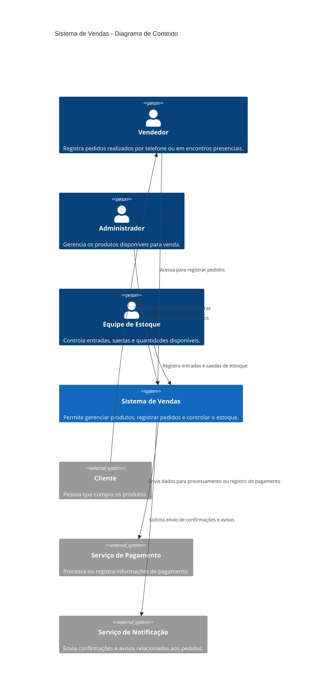

```mermaid
C4Context
title Sistema de Vendas - Diagrama de Contexto

Person(vendedor, "Vendedor", "Registra pedidos realizados por telefone ou em encontros presenciais.")
Person(administrador, "Administrador", "Gerencia os produtos disponíveis para venda.")
Person(equipeEstoque, "Equipe de Estoque", "Controla entradas, saedas e quantidades disponíveis.")

System(sistemaVendas, "Sistema de Vendas", "Permite gerenciar produtos, registrar pedidos e controlar o estoque.")

System_Ext(cliente, "Cliente", "Pessoa que compra os produtos.")
System_Ext(meiosPagamento, "Serviço de Pagamento", "Processa ou registra informações de pagamento.")
System_Ext(notificacao, "Serviço de Notificação", "Envia confirmações e avisos relacionados aos pedidos.")

Rel(vendedor, sistemaVendas, "Acessa para registrar pedidos")
Rel(administrador, sistemaVendas, "Cadastra e remove produtos")
Rel(equipeEstoque, sistemaVendas, "Registra entradas e saedas de estoque")
Rel(cliente, vendedor, "Solicita produtos e realiza compras")
Rel(sistemaVendas, meiosPagamento, "Envia dados para processamento ou registro do pagamento")
Rel(sistemaVendas, notificacao, "Solicita envio de confirmações e avisos")
```
