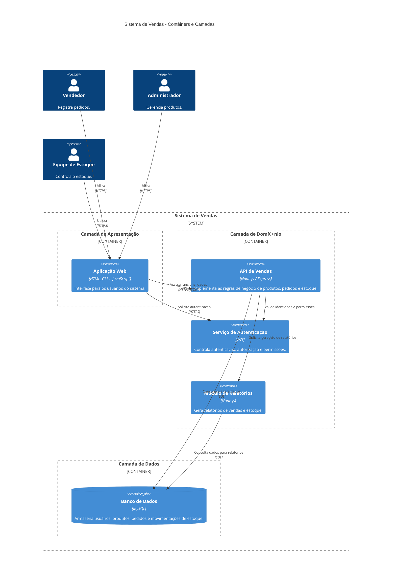

```mermaid
C4Container
title Sistema de Vendas - Contêiners e Camadas

Person(vendedor, "Vendedor", "Registra pedidos.")
Person(administrador, "Administrador", "Gerencia produtos.")
Person(equipeEstoque, "Equipe de Estoque", "Controla o estoque.")

System_Boundary(sistema, "Sistema de Vendas") {

    Container_Boundary(apresentacao, "Camada de Apresentação") {
        Container(frontend, "Aplicação Web", "HTML, CSS e JavaScript", "Interface para os usuários do sistema.")
    }

    Container_Boundary(dominio, "Camada de Domí¢¢nio") {
        Container(api, "API de Vendas", "Node.js / Express", "Implementa as regras de negócio de produtos, pedidos e estoque.")

        Container(auth, "Serviço de Autenticação", "JWT", "Controla autenticação, autorização e permissões.")

        Container(report, "Módulo de Relatórios", "Node.js", "Gera relatórios de vendas e estoque.")
    }

    Container_Boundary(dados, "Camada de Dados") {
        ContainerDb(database, "Banco de Dados", "MySQL", "Armazena usuários, produtos, pedidos e movimentações de estoque.")
    }
}

Rel(vendedor, frontend, "Utiliza", "HTTPS")
Rel(administrador, frontend, "Utiliza", "HTTPS")
Rel(equipeEstoque, frontend, "Utiliza", "HTTPS")

Rel(frontend, auth, "Solicita autenticação", "HTTPS")
Rel(frontend, api, "Acessa funcionalidades", "HTTPS/JSON")

Rel(api, auth, "Valida identidade e permissões")
Rel(api, database, "Consulta e altera dados", "SQL")
Rel(report, database, "Consulta dados para relatórios", "SQL")
Rel(api, report, "Solicita gera窣o de relatórios")
```
