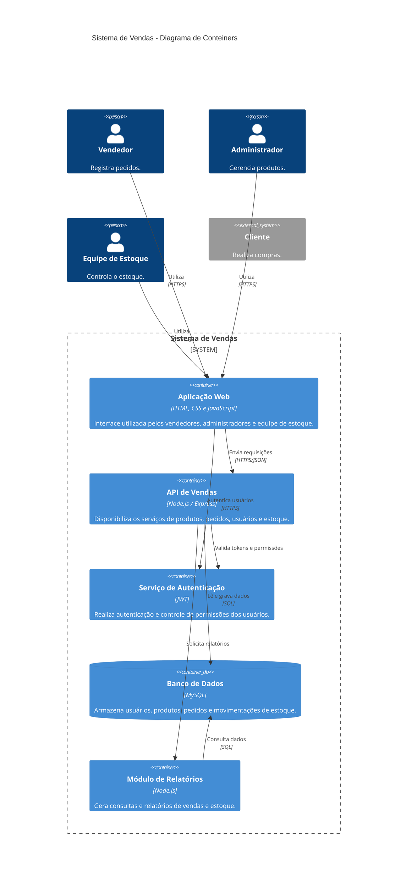

```mermaid
C4Container
title Sistema de Vendas - Diagrama de Conteiners

Person(vendedor, "Vendedor", "Registra pedidos.")
Person(administrador, "Administrador", "Gerencia produtos.")
Person(equipeEstoque, "Equipe de Estoque", "Controla o estoque.")

System_Ext(cliente, "Cliente", "Realiza compras.")

System_Boundary(sistema, "Sistema de Vendas") {
    Container(frontend, "Aplicação Web", "HTML, CSS e JavaScript", "Interface utilizada pelos vendedores, administradores e equipe de estoque.")

    Container(api, "API de Vendas", "Node.js / Express", "Disponibiliza os serviços de produtos, pedidos, usuários e estoque.")

    Container(auth, "Serviço de Autenticação", "JWT", "Realiza autenticação e controle de permissões dos usuários.")

    ContainerDb(database, "Banco de Dados", "MySQL", "Armazena usuários, produtos, pedidos e movimentações de estoque.")

    Container(report, "Módulo de Relatórios", "Node.js", "Gera consultas e relatórios de vendas e estoque.")
}

Rel(vendedor, frontend, "Utiliza", "HTTPS")
Rel(administrador, frontend, "Utiliza", "HTTPS")
Rel(equipeEstoque, frontend, "Utiliza", "HTTPS")

Rel(frontend, auth, "Autentica usuários", "HTTPS")
Rel(frontend, api, "Envia requisições", "HTTPS/JSON")
Rel(api, auth, "Valida tokens e permissões")
Rel(api, database, "Lê e grava dados", "SQL")
Rel(report, database, "Consulta dados", "SQL")
Rel(api, report, "Solicita relatórios")
```
